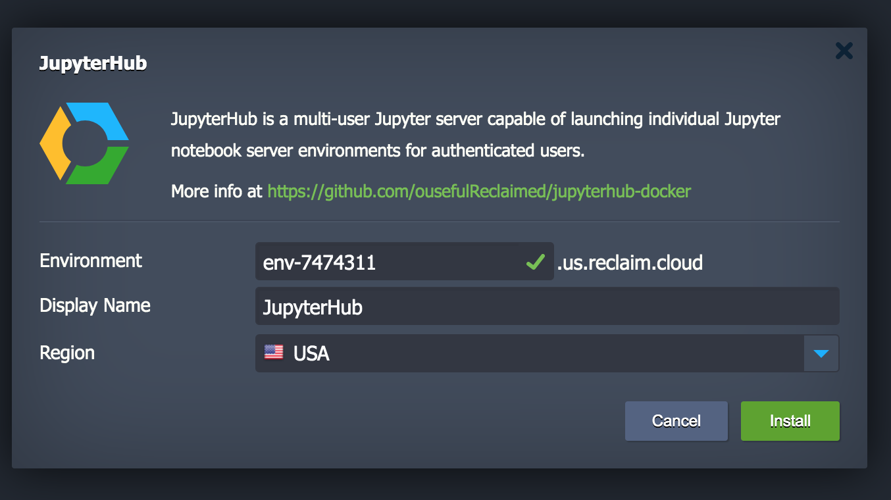
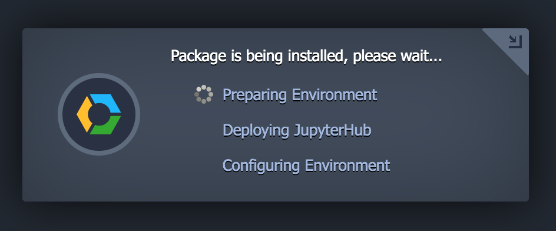
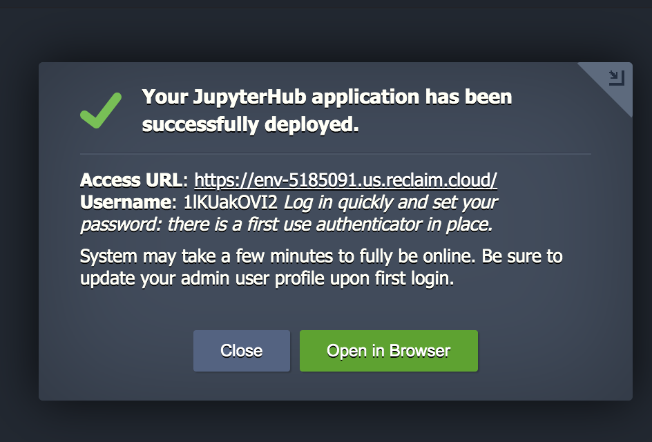
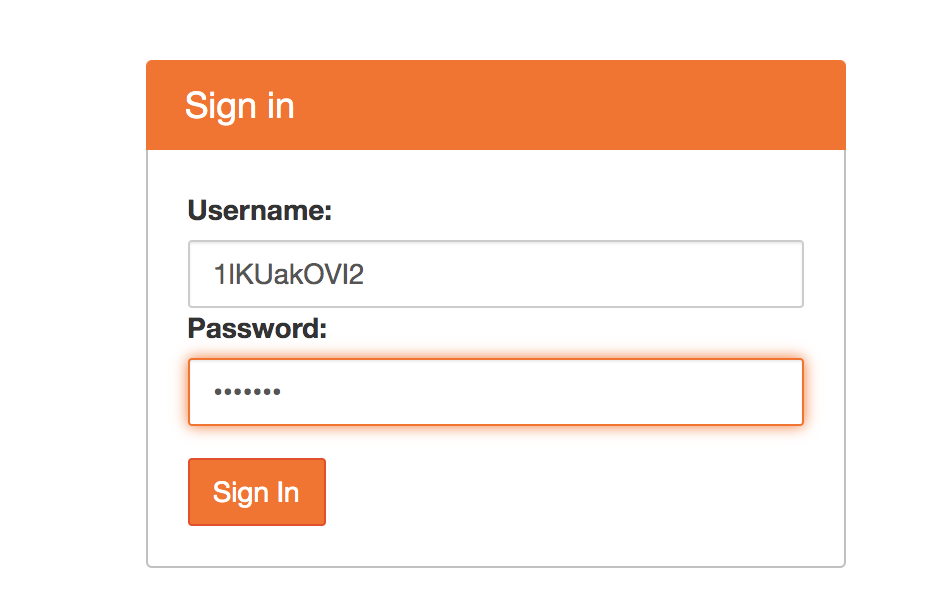
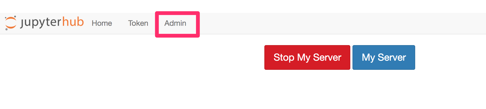

# JupyterHub deployment for use On Reclaim.Cloud

Run a JupyterHub instance on [Reclaim.Cloud](https://reclaim.cloud/):

[](https://app.my.reclaim.cloud/?jps=https://github.com/ousefulReclaimed/jupyterhub-docker/blob/reclaim/manifest.jps)

If you are logged in to Reclaim Cloud, click to launch the environment from the `manifest.jps` pulled automatically from this repository:



The build and deployment phase may take some time... So much time that you might thing it's broken. Enought for what feels like a short meal, rather than a quick coffee, at times... *(Am I doing something wrong in setup to make this worse?!)*



When eveything is ready, you'll be provided with a link to the environment, and the randomly generated name of a single admin user created:



The JupyterHub server is set up with a first use authenticator that allows new users to log in with a new name and set a password as they do so. *This includes the admin user.* So log in early with this generated admin user name to set the admin password. (You may then want to create additional admin users with more memorable names.)



When you do log in with the admin user, from the control panel you should see the *Admin* tab:



If you forget the name of the admin user, you should be able to look it up from the environment console: `echo $JUPYTER_ADMIN_USER` (run `prinen` to list all the environment variables).


## About
This is a [JupyterHub](https://jupyter.org/hub) deployment based on
Docker originally inspired by [`defeo/jupyterhub-docker`](https://github.com/defeo/jupyterhub-docker) (described [here](https://opendreamkit.org/2018/10/17/jupyterhub-docker/)), partially funded by the EU H2020 project [OpenDreamKit](https://opendreamkit.org/), and as used at the [Université de
Versailles](https://jupyter.ens.uvsq.fr/).


## Features

- Containerized single user Jupyter servers, using
  [DockerSpawner](https://github.com/jupyterhub/dockerspawner);
- first use authenticator;
- User data persistence;

The HTTPs reverse-proxy as used in the original has been removed with the intention that https and load reverse-proxy support are provided by the Jelastic platfrom on the host.


### Manual Execution

In Reclaim.Cloud:

- create a new environment;
- select the docker engine / docker-compose setup and create;
- open web ssh terminal;
- run:

```
git clone --branch reclaim https://github.com/ouseful-testing/jupyterhub-docker/
cd jupyterhub-docker
docker-compose up -d
```

Read the [Docker Compose manual](https://docs.docker.com/compose/) to
learn how to manage your application.
